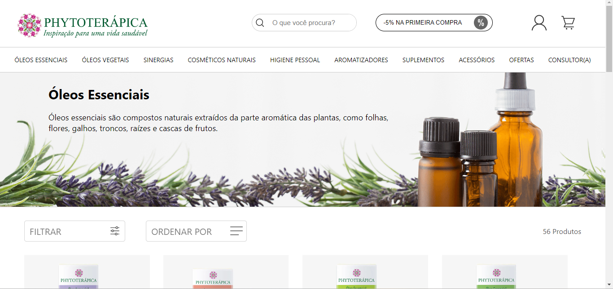

<link rel="stylesheet" href="https://cdn.jsdelivr.net/gh/devicons/devicon@v2.15.1/devicon.min.css">
          
# Phytoterapica - Exercício de Cópia em React JS

Uma Cópia do site da Phytoterapica, e-commerce de óleos essenciais veganos e vegetarianos

 
 

Esse projeto faz parte dos exercícios de React JS, ministrados pela Professora Débora no Instituto PROA;

#

<h2 align="center"> Linguagens Utilizadas no Projeto</h2>
 

    

#

<h2 align ="center"> Ferramentas de Apoio</h2>
 

    
    
          

#

<h2 align="center">Links para Acesso</h2>
 

Clique nas Imagens para acessar o meu link do Linkedin ou da plataforma original da Phytoterapica:
       
    
    

